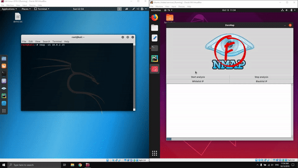

# DenMap

DenMap is a program that detects Nmap scans, logs them, and gives alerts to the user. Additionally, the program logs intruder’s IP address, supports whitelists/blacklists, and sends email alerts to the administrator. After a suspect sends too much "shady" traffic to our computer, he or she will be banned by the firewall.

# Documentation
### Inspiration
We wanted to create an application that is able to block and send out alerts when our ports are scanned by potential attackes using Nmap

### How we built DenMap
DenMap needs Pillow, requests, scapy, and tkinter to run. The application is built to send email alerts to the administrator while logging the data into a text file. The GUI is built to show the IP addresses with geolocation and the taken action affected by the IP address. Besides, the user can add an IP address to the whitelist or blacklist in the GUI. The program will check the input to ensure that it's valid.

### Challenges we ran into
* Geolocation of ipstack API. We spend time learning how to apply it to our project.
* Nmap and tkinter are new to some of us so it took time to get the code produced.
* Run and terminate the thread properly.
* Ethernet analysis
* Email and password are entered in the backend code so we need to change it to the GUI. That will allow the user to input their email and password.

### Accomplishments that we're proud of
We're able to successfully block the scan and find the location of the scanner.

### What we learned
* TCP packets
* Wireshark + Nmap
* Ipstack API and its application
* Create text file and compose emails
* Send automated email alerts
* Build a GUI

### What's next for DeNMAP
The next step for DenMap is to detect which type of attack is being executed by the attacker. If we analyze the ethernet traffic in-depth, we will see 5 different attack methods used by Nmap.
* TCP Scan
* SYN Scan
* Xmas Scan
* FIN Scan
* Null Scan

Read more here https://nmap.org/book/man-port-scanning-techniques.html

# Usage
Check if both machines are connected with each other
<pre><code>ping -c 3 IPv4</code></pre>
Use Nmap to scan for open ports and services running on them
<pre><code>nmap IPv4</code></pre>
Now let's launch DenMap to see how it protects the user from Nmap scans!
Make sure you run the program as root to analyze ethernet traffic
<pre><code>sudo python3 denmap.py</code></pre>

# Requirements
* Pillow
* requests
* Scapy
* Tkinter
